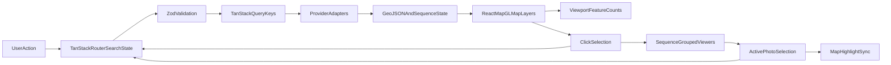

# Street-Level Meta Catalog SPA Plan (React 19 + URL-First State)

## 1) Product Goal
Build an English-only single-page app (SPA) deployed on GitHub Pages that serves as a **meta-catalog of street-level imagery providers** (all iD-editor providers in v1), with:
- Full-screen map center
- Left panel for provider/style/filter controls
- Right panel for clicked-area photo exploration and viewer navigation
- URL as the **primary source of truth** for all shareable state

## 2) Naming Proposals (English)
Recommended name: **StreetLens Atlas**

Alternatives:
- **StreetView MetaCatalog**
- **OpenStreet Imagery Atlas**
- **Panorama Provider Atlas**
- **StreetPhoto Provider Index**
- **Street Imagery Exchange**
- **Open Panorama Registry**
- **StreetScope Catalog**

Selection criteria:
- Clearly signals meta-catalog intent
- Understandable by OSM/mapping users
- Works as project/repo/domain name

## 3) Hard Technical Constraints (from requirements)
- Runtime/build: Bun + Vite 8
- UI: React 19
- Routing + URL state: TanStack Router search params (validated with Zod 4 only)
- Data fetching/cache: TanStack Query
- State strategy:
  - URL state for all shareable state (primary read/write state)
  - Zustand only for non-shareable ephemeral UI state
  - Local `useState` only for local, non-derived component state
- Map stack: React Map GL + MapLibre GL JS
- Must use top-level `MapProvider` and access map via `useMap()` in children
- Must avoid direct imperative MapLibre orchestration when React Map GL handlers/APIs exist
- Use event handlers / render props patterns where appropriate; avoid unnecessary effects and derived-state anti-patterns
- React Compiler enabled and respected (lint/rules + coding style compatible)
- Styling: Tailwind CSS (single mode only: **Light mode only**, no toggle)
- Tests: Vitest (and optional Playwright later)
- Lint/format: oxlint + oxfmt (+ prettier-compatible conventions from stack doc)

Reference stack doc: [tech-stack.md](https://gist.githubusercontent.com/tordans/97b2a927494fa0be14751d4cbdb561cf/raw/2e852119d61a59811dec1c29f76954de8447c22b/tech-stack.md)

## 4) Scope Definition (v1)
### Included
- All street-level providers used by iD overlays in v1:
  - `mapillary`
  - `panoramax`
  - `kartaview`
  - `mapilio`
  - `streetside`
  - `vegbilder`
  - `mapillary-signs`
  - `mapillary-map-features`
  - `panoramax-traffic-signs` (newly researched Panoramax endpoint, modeled similarly to Mapillary signs)
- Two major map visualization styles:
  1. **Photo Type style** (panorama vs flat/classic)
  2. **Age style** (freshness classes)
- Left panel:
  - App title + short intro
  - Provider list (all active by default, user can disable)
  - Style selector
  - Compact per-provider legend that changes by current style
  - In-viewport counts per legend category (computed from rendered/queried map features)
- Right panel:
  - Clicked-area results grouped by sequence
  - One viewer entry per sequence
  - Prev/next navigation inside sequence
  - Map highlight synchronized with currently active photo

### Excluded (v1)
- Light/dark theme switch
- Authenticated provider flows requiring user login
- Non-map list-first experiences

## 5) iD Editor Extraction Inputs To Reuse
Source path for analysis: [/Users/tordans/Development/OSM/iD](/Users/tordans/Development/OSM/iD)

Extraction goals and deliverables:
1. Provider registry and endpoint inventory
2. Data/overlay model (images/sequences/markers/heading)
3. Date filter behavior and edge cases
4. Viewer navigation and selected-image synchronization model

Confirmed important iD patterns to mirror:
- Service-driven provider adapters with cached spatial querying
- Sequence-aware rendering model
- Deep-link style state (`photo`, map position, overlay/filter parameters)
- Provider-specific viewer logic behind a shared interface

Mapillary freshness style reference to align age buckets/colors:
- [/Users/tordans/Development/FMC/tilda-geo/app/src/components/regionen/pageRegionSlug/mapData/mapDataSubcategories/subcat_mapillaryCoverage.const.ts](/Users/tordans/Development/FMC/tilda-geo/app/src/components/regionen/pageRegionSlug/mapData/mapDataSubcategories/subcat_mapillaryCoverage.const.ts)

## 6) URL-First State Contract (Primary State)
Use TanStack Router search params + Zod schema as canonical state.

Core URL search state:
- `map`: `{ z, lat, lon }` (zoom rounded)
- `providers`: active provider IDs array
- `style`: `'photoType' | 'age'`
- `photoTypes`: optional filters for pano/flat
- `date`: optional `{ from?: ISODate, to?: ISODate }`
- `clicked`: clicked map context (lng/lat + optional feature cluster footprint)
- `selected`: currently active selection by provider/sequence/photo

Mandatory shared state in URL:
- map viewport
- provider toggles
- style mode
- clicked location context
- selected sequence/photo identity per active provider (to restore right-panel viewer + map highlight)

Validation policy:
- Zod-only validation and coercion where possible
- No custom ad-hoc type guards unless unavoidable

TanStack Router navigation semantics:
- Always set navigation to "do not jump to top" behavior (disable scroll reset on search-only updates)
- Map state updates (`map`, `clicked`, transient `selected` movement updates) use replace mode (do not write browser history)
- Provider and filter updates (`providers`, `style`, `photoTypes`, `date`) write browser history for user navigation/undo

## 7) Architecture

### Major modules
- Routing and URL schema
  - [src/app/router.tsx](src/app/router.tsx)
  - [src/app/searchSchema.ts](src/app/searchSchema.ts)
- Map shell and provider context
  - [src/app/AppShell.tsx](src/app/AppShell.tsx)
  - [src/features/map/MapRoot.tsx](src/features/map/MapRoot.tsx)
  - [src/features/map/MapProviderRoot.tsx](src/features/map/MapProviderRoot.tsx)
- Provider adapters (all iD providers)
  - [src/features/providers/adapters/mapillary.ts](src/features/providers/adapters/mapillary.ts) (single adapter file containing Mapillary imagery + signs + map-features handling to keep naming consistent)
  - [src/features/providers/adapters/panoramax.ts](src/features/providers/adapters/panoramax.ts) (imagery + Panoramax traffic-signs handling)
  - [src/features/providers/adapters/kartaview.ts](src/features/providers/adapters/kartaview.ts)
  - [src/features/providers/adapters/mapilio.ts](src/features/providers/adapters/mapilio.ts)
  - [src/features/providers/adapters/streetside.ts](src/features/providers/adapters/streetside.ts)
  - [src/features/providers/adapters/vegbilder.ts](src/features/providers/adapters/vegbilder.ts)
- Shared provider model
  - [src/features/providers/model.ts](src/features/providers/model.ts)
  - [src/features/providers/registry.ts](src/features/providers/registry.ts)
- Filters and styles
  - [src/features/filters/dateFilter.ts](src/features/filters/dateFilter.ts)
  - [src/features/styles/styleDefinitions.ts](src/features/styles/styleDefinitions.ts)
  - [src/features/styles/ageBuckets.ts](src/features/styles/ageBuckets.ts)
- Panels
  - [src/features/panels/LeftPanel.tsx](src/features/panels/LeftPanel.tsx)
  - [src/features/panels/ProviderLegend.tsx](src/features/panels/ProviderLegend.tsx)
  - [src/features/panels/RightPanel.tsx](src/features/panels/RightPanel.tsx)
- Viewer + sequence coordination
  - [src/features/viewer/SequenceViewer.tsx](src/features/viewer/SequenceViewer.tsx)
  - [src/features/viewer/useSequenceSelection.ts](src/features/viewer/useSequenceSelection.ts)
  - [src/features/viewer/useMapHighlightSync.ts](src/features/viewer/useMapHighlightSync.ts)
- API/data services
  - [src/features/data/queries.ts](src/features/data/queries.ts)
  - [src/features/data/geojsonTransforms.ts](src/features/data/geojsonTransforms.ts)

## 8) UI/UX Plan
### Global layout
- 3-column app frame:
  - Left fixed panel (controls + legends)
  - Center fluid map canvas (full-height)
  - Right fixed panel (clicked-area imagery)
- Modern single-theme visual language (light mode)

### Left panel sections
1. App name + concise intro
2. Provider toggles (all on by default)
3. Style selector (Photo Type / Age)
4. Compact dynamic legends per provider + counts in current viewport

Legend behavior:
- Photo Type style: e.g. `Flat` + `Panorama` with colors/icons
- Age style: freshness buckets from Mapillary reference (e.g. <=2y, 2-4y, >4y)
- Count values derived from current map viewport feature set

### Right panel behavior
- Click on map selects nearby images/features
- Group entries by sequence (deduplicate very close photos from same sequence)
- Render one sequence viewer item
- Prev/next updates active photo and map highlight in real time
- Selection persists/restores from URL

## 9) Map + Interaction Design
- `MapProvider` at top-level; child components use `useMap()`
- Use React Map GL event handlers (`onClick`, `onMoveEnd`, etc.)
- Use `interactiveLayerIds` for clickable layers; consume `event.features` directly since React Map GL already pre-filters this list by interactive layer IDs
- Avoid direct imperative MapLibre usage unless no React Map GL equivalent exists
- Zoom handling:
  - Round zoom for URL state persistence
  - Keep smooth map experience while serializing rounded zoom
- Provider layers:
  - Separate source/layer configs per provider and style mode
  - Distinct treatment for point, line, and special layers (e.g. signs/features)

## 10) Provider Integration Strategy (all providers in v1)
For each provider:
1. Define endpoint/source config + required params
2. Build fetch/transform adapter -> normalized feature model
3. Add style mappings (photoType + age)
4. Add provider-specific viewer capability (if available)
5. Wire to URL-based enable/disable and filter state

Normalization contract (cross-provider):
- `providerId`
- `photoId`
- `sequenceId`
- `capturedAt`
- `isPano`
- `heading`
- `geometry`
- `viewerPayload`

Special handling:
- Date filter behavior aligned with iD findings
- Sequence grouping resilient to provider data differences
- Viewer fallback when provider has limited navigation metadata
- Panoramax traffic-sign feature endpoint integrated with the same normalization and style pipeline used for Mapillary signs/map features

## 11) React 19 + React Compiler + State Management Rules
- Keep render pure; avoid side-effectful renders
- Prefer event handlers and derived values in render over effect-based synchronization
- Use effects only for true external synchronization (network/map imperative bridges)
- Keep URL state write paths centralized (single route-state update helpers)
- Avoid storing duplicated derived state in `useState`
- Split concerns into focused hooks/components (small files, clear boundaries)
- Ensure project configuration enables React Compiler and compiler-friendly patterns

## 12) Testing and Verification Plan
### Unit tests (Vitest)
- URL schema parse/serialize round-trip
- Date range logic (including edge-case swaps)
- Style bucket mapping (photoType + age)
- Sequence grouping and deduplication
- Provider normalization transforms

### Integration/component tests
- Left panel toggles update URL and map layers
- Map click populates right panel grouped sequences
- Viewer prev/next updates active marker highlight + URL selected state
- URL restore recreates full UI state

### Optional e2e (later phase)
- GitHub Pages deployed build smoke flow
- Deep-link open and state restoration

## 13) GitHub Pages SPA Deployment
- Vite base path configured for repository pages
- SPA fallback strategy for client routing on static hosting
- CI workflow for build and deploy
- Validate asset paths and router behavior under GitHub Pages base URL

Planned files:
- [vite.config.ts](vite.config.ts)
- [src/main.tsx](src/main.tsx)
- [.github/workflows/deploy.yml](.github/workflows/deploy.yml)

## 14) Delivery Phases and Acceptance Criteria
### Phase 0 — Foundation
- Project scaffold, React 19, TanStack Router/Query, Tailwind, lint/test setup
- Acceptance: app boots, routing works on local and GH Pages preview

### Phase 1 — URL state and map shell
- Canonical Zod search schema + map/provider/style state wiring
- Acceptance: URL is single source of truth for viewport/providers/style

### Phase 2 — Provider data adapters (all iD providers)
- Implement all provider adapters + normalized model
- Acceptance: all providers render on map and can be toggled

### Phase 3 — Styles, legends, viewport counts
- Dynamic style switch + legends + in-viewport counts
- Acceptance: legends/counts match visible features and style changes

### Phase 4 — Right panel viewer synchronization
- Click-to-select, sequence grouping, prev/next, map highlight sync
- Acceptance: selection and active photo state restore from URL

### Phase 5 — QA and deploy hardening
- Tests, edge-case fixes, performance review, final GH Pages deploy
- Acceptance: deep-link state restoration verified across refresh/share

## 15) Risks and Mitigations
- Provider API inconsistency/rate limits:
  - Mitigation: adapter isolation + robust fallbacks + query retry/backoff
- Large point volumes impacting performance:
  - Mitigation: zoom-gated rendering, viewport-limited counting, memoized transforms
- Complex URL state drift:
  - Mitigation: single search-state codec + strict Zod schema + route tests
- Viewer parity differences across providers:
  - Mitigation: unified sequence controller interface + graceful capability degradation

## 16) Definition of Done
- English-only UI copy
- Light-mode only design delivered
- All iD street-level providers integrated in v1
- URL-first state fully implemented and validated via Zod
- React 19 + compiler-compatible architecture and clean state management
- Map click -> right panel grouped viewers -> prev/next -> map highlight loop complete
- GitHub Pages deployment live with shareable deep links

## 17) Dependency Supply-Chain Posture: Bun Gate + taze Maturity
Apply a 5-day supply-chain posture in Bun installs (`minimumReleaseAge`) and align voluntary update tooling (`taze --maturity-period 5`) with the same spirit.

### Context
- Bun gate policy: `[install] minimumReleaseAge = 432000` (5 days in seconds), with optional `minimumReleaseAgeExcludes` only when needed.
- Repository layout requires per-project `bunfig.toml` because install contexts are separate (`app/` and `processing/` each with their own `package.json` and `bun.lock`).
- CI executes installs with project working directories, so root-only config is not sufficient.

### Required changes
1. Add `app/bunfig.toml` with:
   - `[install]`
   - `minimumReleaseAge = 432000`
2. Add `processing/bunfig.toml` with the same install block.
3. Update `app.Dockerfile` dependency layer `COPY` to include `app/bunfig.toml` before `bun install`.
4. Extend all taze invocations in:
   - [`app/scripts/predev/checkPackageUpdates.ts`](app/scripts/predev/checkPackageUpdates.ts)
   - [`app/scripts/updatePackages/index.ts`](app/scripts/updatePackages/index.ts)
   with `--maturity-period 5`.

### Docker implications
- `app.Dockerfile`: must explicitly include `app/bunfig.toml` in the deps layer before `RUN bun install`.
- `processing.Dockerfile`: no Dockerfile change required if it already copies the entire `processing/` directory before install.

### Operational note
- `bun install --frozen-lockfile` may fail when lockfile-pinned versions are younger than 5 days.
- Mitigations:
  - wait for package age to pass threshold,
  - pin an older version,
  - add package-specific `minimumReleaseAgeExcludes` only when justified.

### Verification
- `cd app && bun install --frozen-lockfile`
- `cd processing && bun install --frozen-lockfile`
- Optional: build app Docker image to validate dependency install layer with the new `COPY`.

### Out of scope
- npm/pnpm policy files (`.npmrc`, `pnpm-workspace.yaml`)
- unrelated subprojects unless they also run Bun installs and should inherit this policy
